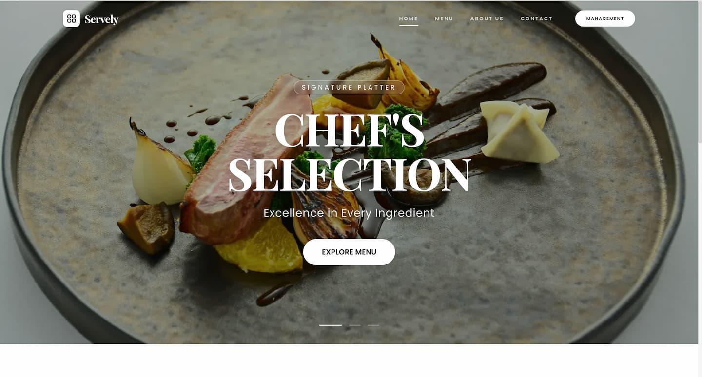
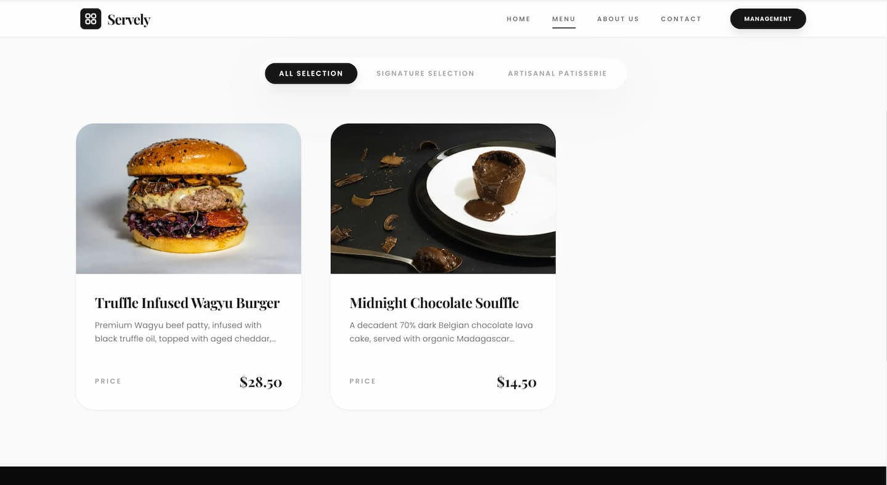
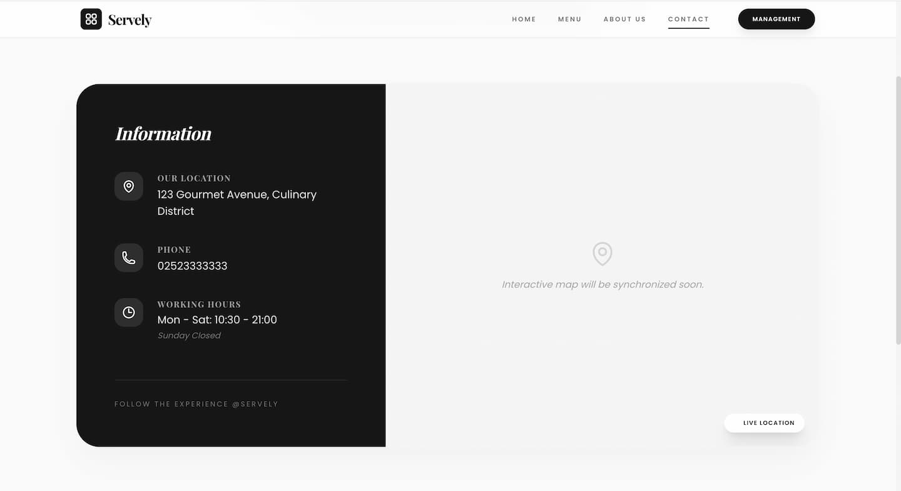
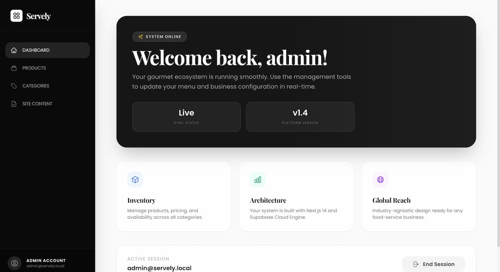
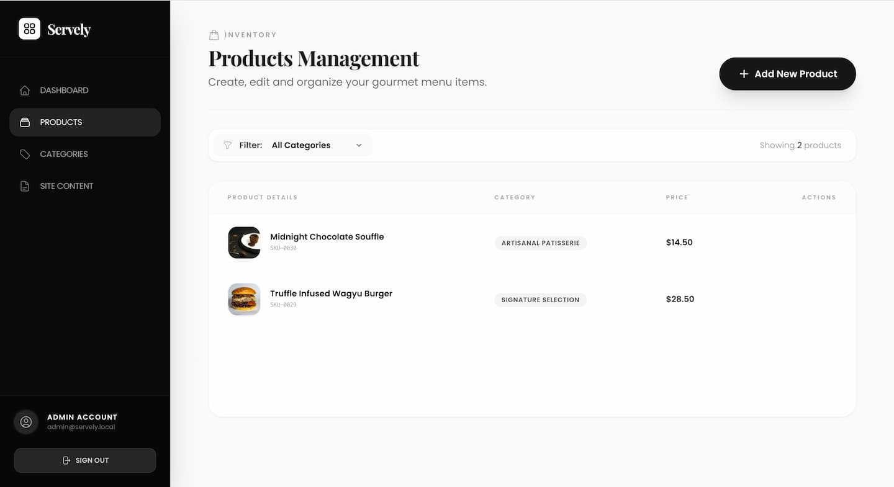
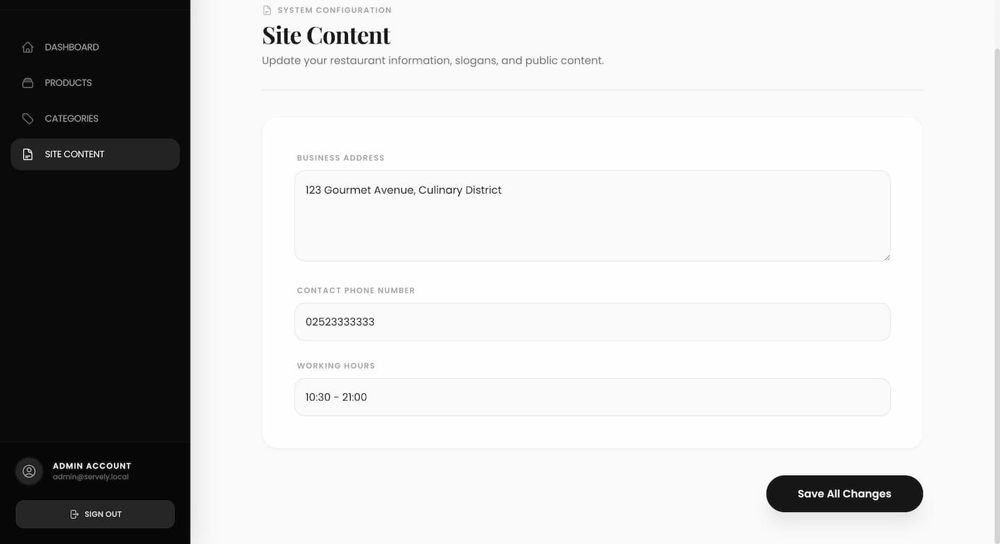
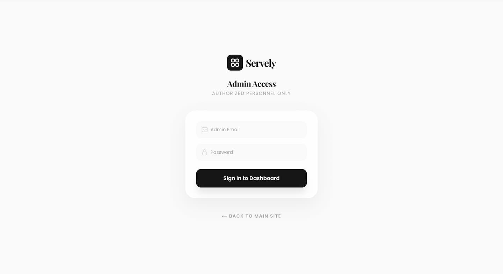
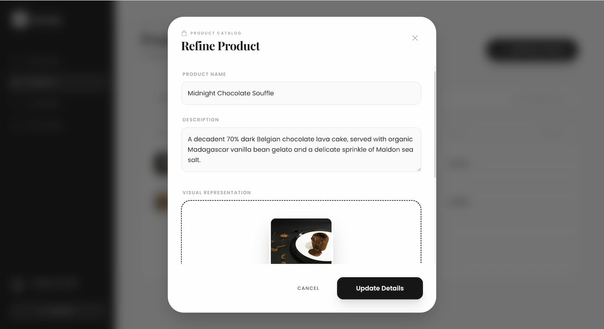
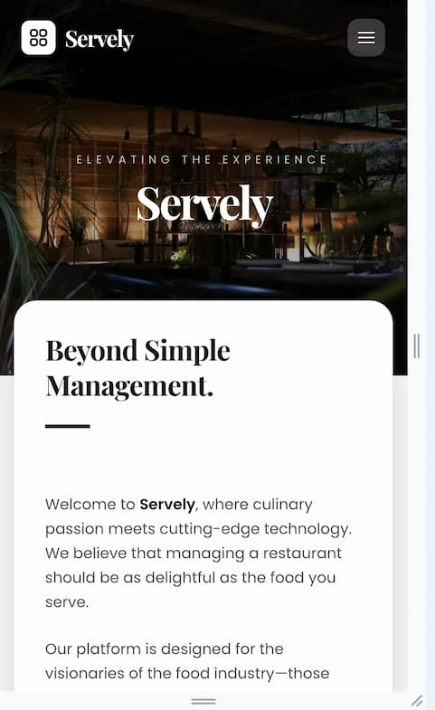

# Servely: Smart Restaurant Management Platform
### *A Joint Engineering Project for Digital Dining Ecosystems*

<p align="center">
  <a href="https://bistro-logic.vercel.app" target="_blank">
    
  </a>
</p>

> ### Collaboration & Credits / Emeği Geçenler
> This platform was co-developed as a **joint project** by [Büşra Konya](https://github.com/busraknya) and **Esra Konya**. Together, we engineered the core architecture and SaaS vision from the ground up.
> 
> *Bu platform, [Büşra Konya] ve **Esra Konya** tarafından **ortak bir proje** olarak geliştirilmiştir. Çekirdek mimari ve SaaS vizyonu ekip çalışmasıyla uçtan uca kurgulanmıştır.*

---

## Product Visual Journey / Uygulama Deneyimi

### Premium Customer Experience
| Luxury Landing Page | Signature Menu | Interactive Contact |
| :---: | :---: | :---: |
|  |  |  |
| *Modern Hero Section* | *Dynamic Product Catalog* | *Global Connectivity* |

### Enterprise Management Dashboard (Admin)
| System Analytics | Product Control | Site Configuration |
| :---: | :---: | :---: |
|  |  |  |
| *Real-time Overview* | *Inventory Management* | *No-Code Content Control* |

<details>
<summary><b>View All Screenshots / Tüm Ekran Görüntülerini Gör</b></summary>

| Detailed Auth Flow | Product Refinement | Mobile View |
| :---: | :---: | :---: |
|  |  | 
</details>

---

### The Vision
**Servely** is a high-performance, industry-agnostic SaaS platform designed to modernize food-service businesses. Moving beyond a local concept, we engineered this platform to be a scalable solution for any dining establishment, focusing on high-end UI/UX and robust data integrity using **Next.js 16** and **Supabase**.

### Technical Highlights
- **Architecture:** Fully compliant with the new asynchronous `cookies()` and `params` logic of Next.js 16.
- **Backend:** Managed Authentication, Relational Database (PostgreSQL), and Object Storage via Supabase.
- **Security:** Advanced Row Level Security (RLS) policies for secure data isolation.
- **UI/UX:** Framer Motion for spring physics, custom cursor interactions, and responsive design.

---

### Vizyon
**Servely**, gıda işletmelerini modernize etmek için tasarlanmış, sektör bağımsız (industry-agnostic) ve yüksek performanslı bir SaaS platformudur. Bu projeyi; premium kullanıcı deneyimi ve ölçeklenebilir bir mimari sunması için ekipçe **Next.js 16** ve **Supabase** teknolojileriyle inşa ettik.

### Teknik Detaylar
- **Mimari:** Next.js 16 ile gelen yeni asenkron `cookies()`/`params` yapısına tam uyumlu modern yapı.
- **Altyapı:** Supabase üzerinden uçtan uca kimlik doğrulama, PostgreSQL ve Storage yönetimi.
- **Güvenlik:** Veritabanı seviyesinde Satır Bazlı Güvenlik (RLS) politikaları ile tam koruma.
- **Arayüz:** Framer Motion ile akışkan animasyonlar, özel imleç fiziği ve tam duyarlı tasarım.

---

## Project Structure / Proje Yapısı
```text
src/
├── app/             # App Router (Admin, Login, API Routes)
├── components/      # UI Library (Tables, Modals, Product Cards)
├── hooks/           # Performance Hooks (Cursor tracking, etc.)
├── lib/             # Data Access Layer & Type Definitions
├── proxy.ts         # Edge-side Security Logic
└── ...              # Docker & Global Configs
